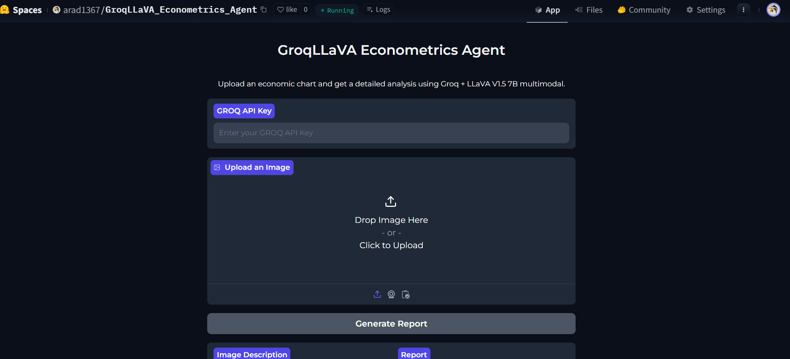

# GroqLLaVAMA Econometrics Agent

Welcome to the **GroqLLaVAMA Econometrics Agent**! This application is designed to assist you with econometric analyses using the power of large language models. You can interact with the agent to upload econometric charts, get insights, and perform computations or visualizations related to econometrics, all within an easy-to-use interface hosted on Hugging Face Spaces.

🔗 **App Link**: [GroqLLaVAMA Econometrics Agent](https://huggingface.co/spaces/arad1367/GroqLLaVAMA_Econometrics_Agent)

## Features

- **User-friendly Interface**: Interact with the agent in a conversational style.
- **Econometric Support**: Upload an image regarding various econometric topics such as regression analysis, hypothesis testing, and time-series analysis, and even marketing charts.
- **Visualization**: The application can provide visual outputs for data analysis and modeling results.
- **Powered by Groq + LLaVA + Llama 3.1**: Leverages advanced language models for accurate and comprehensive responses.

## Usage

1. Visit the app using this [link](https://huggingface.co/spaces/arad1367/GroqLLaVAMA_Econometrics_Agent).
2. Start by loading an image.
3. View text-based and graphical responses generated by the agent.
4. Utilize the results for research, educational purposes, or professional econometric analysis.

## Installation

This app is hosted directly on Hugging Face Spaces, so there is no need for local installation. Simply navigate to the provided link and begin using the tool directly in your web browser.

However, if you'd like to clone the repository and run it locally, follow these steps:

1. Clone the repository:
   `git clone https://huggingface.co/spaces/arad1367/GroqLLaVAMA_Econometrics_Agent`
   `cd GroqLLaVAMA_Econometrics_Agent`

2. Install the dependencies
    `pip install -r requirements.txt`

3. Run the app
    `python app.py`

* Contact
- For any questions, suggestions, or inquiries, feel free to reach out:

- Email: `pejman.ebrahimi77@gmail.com`, `pejman.ebrahimi.uni.li`

* License
- This project is licensed under the Apache 2.0 License. 